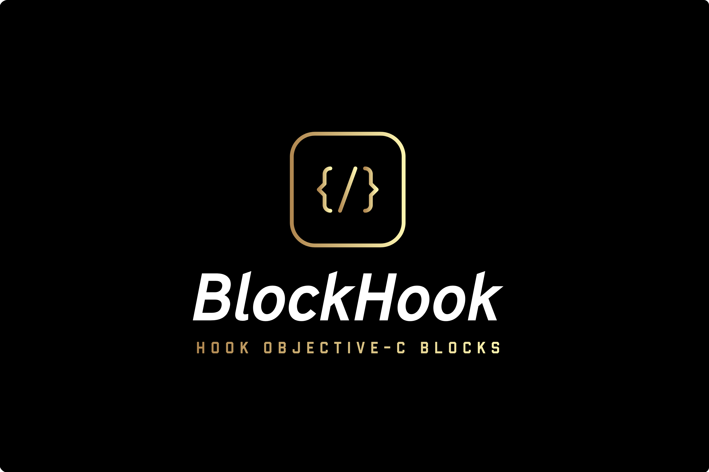

<p align="center">
<a href="https://github.com/yulingtianxia/BlockHook">

</a>
</p>

[](http://cocoapods.org/pods/BlockHook)
[](https://travis-ci.org/yulingtianxia/BlockHook)
[](http://cocoapods.org/pods/BlockHook)
[](https://github.com/Carthage/Carthage)
[](https://codecov.io/gh/yulingtianxia/BlockHook)
[](https://app.codacy.com/app/yulingtianxia/BlockHook?utm_source=github.com&utm_medium=referral&utm_content=yulingtianxia/BlockHook&utm_campaign=Badge_Grade_Dashboard)
[](https://github.com/yulingtianxia/BlockHook/releases)
[](https://twitter.com/yulingtianxia)

# BlockHook

Hook Objective-C blocks with libffi. It's a powerful AOP tool for blocks. BlockHook can run your code before/instead/after invoking a block. BlockHook can even notify you when a block dealloc. You can trace the whole lifecycle of a block using BlockHook!

## 📚 Article

- [Hook Objective-C Block with Libffi](http://yulingtianxia.com/blog/2018/02/28/Hook-Objective-C-Block-with-Libffi/)
- [BlockHook with Struct](http://yulingtianxia.com/blog/2019/04/27/BlockHook-with-Struct/)
- [BlockHook with Revocation](http://yulingtianxia.com/blog/2019/05/26/BlockHook-with-Revocation/)
- [BlockHook with Private Data](http://yulingtianxia.com/blog/2019/06/19/BlockHook-with-Private-Data/)
- [BlockHook with Invocation](http://yulingtianxia.com/blog/2019/07/27/BlockHook-with-Invocation/)

## 🌟 Features

- [x] Easy to use. Keep your code clear.
- [x] Support 4 hook modes: Before, Instead, After and Dead.
- [x] Let you modify return value and arguments.
- [x] Support invoking original implementation.
- [x] Remove hook at any time.
- [x] Traverse all hook tokens of block.
- [x] Provide block mangle name.
- [x] Self-managed tokens.
- [x] Support custom struct.
- [x] Support Carthage & CocoaPods.

## 🔮 Example

BlockHook needs libffi, which supports iOS, tvOS and macOS.
You can run `BlockHookSample iOS`, `BlockHookSample tvOS` or `BlockHookSample macOS` target.

## 🐒 How to use

### Just Hook

You can hook a block using 4 modes (before/instead/after/dead). This method returns a `BHToken` instance for more control. You can `remove` a `BHToken`, or set custom return value to its `retValue` property. Calling `invokeOriginalBlock` method will invoke original implementation of the block.

```objc
- (BHToken *)block_hookWithMode:(BlockHookMode)mode
                     usingBlock:(id)block
```

BlockHook is easy to use. Its APIs take example by Aspects. [Here](https://github.com/yulingtianxia/BlockHook/blob/master/BlockHookSampleTests/BlockHookSampleTests.m) is a full set of usage of BlockHook.

This is an example for hooking block in all modes. You can change block return value from 8 to 15. Then remove some hook and check if it is successful. Finally we get callback when block dealloc. 

```objc
NSObject *z = NSObject.new;
int(^block)(int x, int y) = ^int(int x, int y) {
    int result = x + y;
    NSLog(@"%d + %d = %d, z is a NSObject: %@", x, y, result, z);
    return result;
};
    
BHToken *token = [block block_hookWithMode:BlockHookModeDead|BlockHookModeBefore|BlockHookModeInstead|BlockHookModeAfter usingBlock:^(BHInvocation *invocation, int x, int y) {
    int ret = 0;
    [invocation getReturnValue:&ret];
    switch (invocation.mode) {
        case BlockHookModeBefore:
            // BHInvocation has to be the first arg.
            NSLog(@"hook before block! invocation:%@", invocation);
            break;
        case BlockHookModeInstead:
            [invocation invokeOriginalBlock];
            NSLog(@"let me see original result: %d", ret);
            // change the block imp and result
            ret = x * y;
            [invocation setReturnValue:&ret];
            NSLog(@"hook instead: '+' -> '*'");
            break;
        case BlockHookModeAfter:
            // print args and result
            NSLog(@"hook after block! %d * %d = %d", x, y, ret);
            break;
        case BlockHookModeDead:
            // BHInvocation is the only arg.
            NSLog(@"block dead! token:%@", invocation.token);
            break;
        default:
            break;
    }
}];
    
NSLog(@"hooked block");
int ret = block(3, 5);
NSLog(@"hooked result:%d", ret);
// remove token.
[token remove];
NSLog(@"remove tokens, original block");
ret = block(3, 5);
NSLog(@"original result:%d", ret);
```

Here is the log:

```
hooked block
hook before block! invocation:<BHInvocation: 0x600003668940>
3 + 5 = 8, z is a NSObject: <NSObject: 0x6000034245a0>
let me see original result: 8
hook instead: '+' -> '*'
hook after block! 3 * 5 = 15
hooked result:15
remove tokens, original block
hook before block! invocation:<BHInvocation: 0x60000366c7c0>
3 + 5 = 8, z is a NSObject: <NSObject: 0x6000034245a0>
hook after block! 3 * 5 = 8
original result:8
block dead! token:<BHToken: 0x600000422910>
```

### Block Interceptor

Sometimes you want user login first before routing to other components. To intercept a block without hacking into code of routers, you can use block interceptor.

```objc
NSObject *testArg = [NSObject new];
NSObject *testArg1 = [NSObject new];
    
NSObject *(^testblock)(NSObject *) = ^(NSObject *a) {
    return [NSObject new];
};
    
[testblock block_interceptor:^(BHInvocation *invocation, IntercepterCompletion  _Nonnull completion) {
    dispatch_after(dispatch_time(DISPATCH_TIME_NOW, (int64_t)(0.5 * NSEC_PER_SEC)), dispatch_get_main_queue(), ^{
        NSObject * __unsafe_unretained arg;
        [invocation getArgument:&arg atIndex:1];
        NSLog(@"Original argument:%@", arg);
        [invocation setArgument:(void *)&testArg1 atIndex:1];
        completion();
    });
}];
    
testblock(testArg);
```

## 📲 Installation

### CocoaPods

[CocoaPods](http://cocoapods.org) is a dependency manager for Cocoa projects. You can install it with the following command:

```bash
$ gem install cocoapods
```

To integrate BlockHook into your Xcode project using CocoaPods, specify it in your `Podfile`:


```
source 'https://github.com/CocoaPods/Specs.git'
platform :ios, '8.0'
use_frameworks!
target 'MyApp' do
	pod 'BlockHook'
end
```

You need replace "MyApp" with your project's name.

Then, run the following command:

```bash
$ pod install
```

### Carthage

[Carthage](https://github.com/Carthage/Carthage) is a decentralized dependency manager that builds your dependencies and provides you with binary frameworks.

You can install Carthage with [Homebrew](http://brew.sh/) using the following command:

```bash
$ brew update
$ brew install carthage
```

To integrate BlockHook into your Xcode project using Carthage, specify it in your `Cartfile`:

```ogdl
github "yulingtianxia/BlockHook"
```

Run `carthage update` to build the framework and drag the built `BlockHook.framework` into your Xcode project.

### Manual

After importing libffi, just add the two files `BlockHook.h/m` to your project.

## ❤️ Contributed

- If you **need help** or you'd like to **ask a general question**, open an issue.
- If you **found a bug**, open an issue.
- If you **have a feature request**, open an issue.
- If you **want to contribute**, submit a pull request.

## 👨🏻‍💻 Author

yulingtianxia, yulingtianxia@gmail.com

## 👮🏻 License

BlockHook is available under the MIT license. See the LICENSE file for more info.

Thanks to MABlockClosure and Aspects!

